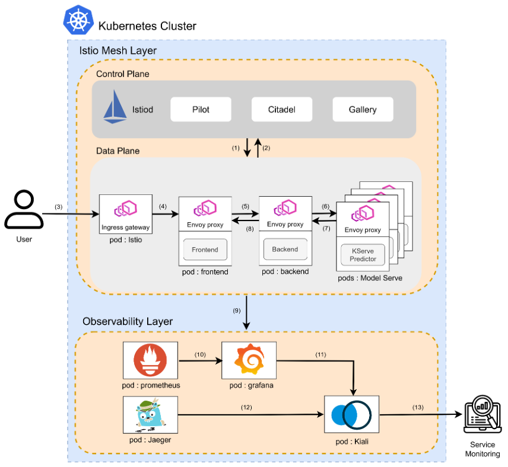

# MS-Serving

클라우드 네이티브 마이크로서비스 기반 AI 모델 서빙 플랫폼

---

## A. 프로젝트 명
**MS-Serving**  
(Cloud-native Microservice-based AI Model Serving Platform)

## B. 프로젝트 멤버 및 담당 파트

| 이름   | 이메일                    | GitHub               | 담당 파트 |
|--------|----------------------------|----------------------|-----------|
| 이광훈 | gbhuni@gmail.com           | [@khuni1](https://github.com/khuni1) | 배포 파일 구성, 쿠버네티스 인프라 구성 |
| 김예슬 | yesul0718@pusan.ac.kr      | [@yeseul-kim01](https://github.com/yeseul-kim01) | 웹 애플리케이션 개발, AI 모델 서빙  배포 파일 구성 |
| 전진혁 | aqwstn@gmail.com           | [@Jeon-Jinhyeok](https://github.com/Jeon-Jinhyeok) | 웹 애플리케이션 개발, 쿠버네티스 인프라 구성   |

## C. 프로젝트 소개

본 프로젝트는 **AI 모델을 클라우드 네이티브 환경에서 효율적으로 배포하고 서비스할 수 있는 플랫폼**을 구축하는 것을 목표로 한다.  
Kubernetes 기반 인프라 위에 KServe, Knative, Istio 등을 활용하여 확장성과 유연성을 제공한다.

## D. 프로젝트 필요성 소개

- 다양한 AI 모델 서빙 요구 증가
- 수요에 따른 오토스케일링 필요
- 안정적인 서비스 품질 보장 필요
- 마이크로서비스 아키텍처 기반 관리의 용이성

## E. 관련 기술 / 논문 / 특허 조사 내용 소개

- KServe: Model Serving용 Kubernetes Custom Resource
- Knative: Serverless Deployment 지원
- Istio: Service Mesh, Traffic Routing
- 참고 논문 및 기술 문서
    - [KServe 공식 문서](https://kserve.github.io/website/latest/)
    - [Knative Docs](https://knative.dev/docs/)
    - [Istio Docs](https://istio.io/latest/docs/)
    - [Service Mesh in Kubernetes: Implementing Istio for Enhanced Observability and Security](https://jsaer.com/download/vol-8-iss-11-2021/JSAER2021-8-11-200-206.pdf)
    - [Envoy 및 Istio 기반의 완전 관리형 서비스 메시](https://cloud.google.com/products/service-mesh)
    - [Red Hat OpenShift Service Mesh](https://www.redhat.com/en/technologies/cloud-computing/openshift/what-is-openshift-service-mesh)


## F. 프로젝트 개발 결과물 소개

### 시스템 아키텍처 다이어그램


### 주요 구성 요소 - Stack Overview

| Component   | Description |
|-------------|-------------|
| KServe      | Model serving CRD (InferenceService) manager |
| Knative     | Serverless deployment of model services (scale-to-zero, auto-scaling) |
| Istio       | Ingress routing and traffic control |
| Spring Boot | Backend API for managing models |
| Next.js     | Frontend for user interface |

## G. 개발 결과물 사용하는 방법

### 설치 방법

```bash
# 1. 서브모듈까지 포함하여 전체 프로젝트 클론
git clone --recurse-submodules https://github.com/2025-PNU-CC-TERM-PROJECT/ms-serving.git

# 2. 이미 클론했다면, 서브모듈 수동 초기화
git submodule init
git submodule update
```
### 접속 방법 

## H. 개발 결과물 활용 방안

본 시스템은 다양한 산업 분야에서 요구되는 고신뢰성 · 고확장성 · 고관찰성을 갖춘 AI 서빙 인프라로서 다음과 같은 방식으로 활용될 수 있다.

- MLOps 기반 AI 모델 게이트웨이
다양한 팀 또는 외부 애플리케이션에 AI 기능을 안전하게 공개
Canary 배포를 통해 서비스 중단 없이 모델 실험 및 교체 가능

- 의료 영상 분석 및 진단
보안 민감 데이터를 기반으로 하는 AI 모델 (예: CT/MRI 영상 분석, 병리 조직 이미지 분석 등)을 다루는 환경에 적용
보안 정책과 인증 체계를 강화하여 안전한 서빙 환경 제공

- 금융 거래 분석 및 서비스 품질 유지
실시간 이상 거래 탐지, 신용 리스크 평가 등의 AI 모델을 지속적으로 업데이트하며 서비스 제공
트래픽 폭주 시 자동 확장(Auto-Scaling) 기능을 통해 안정적인 서비스 품질 유지


